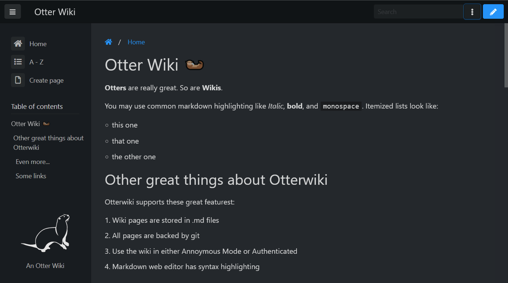

# An Otter Wiki

An Otter Wiki is Python-based software for collaborative content
management, called a [wiki](https://en.wikipedia.org/wiki/Wiki). The
content is stored in a git repository, which keeps track of all changes.
[Markdown](https://daringfireball.net/projects/markdown) is used as
Markup language. An Otter Wiki is written in [python](https://www.python.org/)
using the microframework [Flask](http://flask.pocoo.org/).
[halfmoon](https://www.gethalfmoon.com) is used as CSS framework and [CodeMirror](https://codemirror.net/) as editor.
[Font Awesome Free](https://fontawesome.com/license/free) serves the icons.

### Notable Features

- Minimalistic interface (with dark-mode)
- Full changelog and page history
- User authentication
- Page Attachments
- A very cute Otter as logo (drawn by [Christy Presler](http://christypresler.com/) CC BY 3.0).

## Recommended Installation with docker-compose

1. Copy and edit the `docker-compose.yml` below to match your preferences.
2. Create the folder app-data with `mkdir app-data`according to the path in the `docker-compose.yml`, default in the same directory.
3. Run `docker-compose up -d`
4. Access the wiki via http://127.0.0.1:8080 if run on your machine.
5. If the wiki shall be accessable via the internet and an domainname make sure to configure your web server accordingly. For Nginx e.g., see [Nginx Reverse Proxy](https://docs.nginx.com/nginx/admin-guide/web-server/reverse-proxy/)
6. Register your account. The first account is an admin-account giving you access to the settings tab.
7. Customize the settings to your liking.

## docker-compose.yml

```yaml
version: '3'
services:
  otterwiki:
    image: redimp/otterwiki:latest
    restart: unless-stopped
    ports:
      - 8080:80
    volumes:
      - ./app-data:/app-data
```

## Build from Source ( not recommended!)

## COnfiguration
### Branding

| Variable         |  Example        | Description                                  |
|------------------|-----------------|----------------------------------------------|
| `SITE_NAME`      | `'Otterwiki'`   | The `SITE_NAME` displayed on every page and email |
| `SITE_LOGO`      | `'/Home/a/logo.png'` | Customize navbar logo url (can be a page attachment) |

### Permission configuration

| Variable         |  Example        | Description                                  |
|------------------|-----------------|----------------------------------------------|
| `READ_ACCESS`    | `'ANONYMOUS'`   | Read access to wiki pages and attachments    |
| `WRITE_ACCESS`   | `'REGISTERED'`  | Write access to wiki pages                   |
| `ATTACHMENT_ACCESS` | `'APPROVED'` | Write acccess to attachments                 |
| `AUTO_APPROVAL`  | `False`         | With `AUTO_APPROVAL=True` users are approved on registration |
| `EMAIL_NEEDS_CONFIRMATION`  | `True`         | With `EMAIL_NEEDS_CONFIRMATION=True` users have to confirm their email address |
| `NOTIFY_ADMINS_ON_REGISTER` | `True`  | Notify admins if a new user is registered |

There are four types of users in the Otterwiki: `ANONYMOUS` are non logged in users.
Users that registered via email and are logged in are `REGISTERED`, users approved via
the settings menu by an admin are `APPROVED`. In addition to the `APPROVED` flag the `ADMIN`
flag can be set. Users with the `ADMIN` flag can edit (and approve) other users. The first registered user is flagged as admin.

### Mail configuration

An Otter Wiki is using [Flask-Mail](https://pythonhosted.org/Flask-Mail/). 

| Variable         |  Example        | Description                                  |
|------------------|-----------------|----------------------------------------------|
| `MAIL_DEFAULT_SENDER` | `'otterwiki@example.com'` | The sender address of all mails |
| `MAIL_SERVER`    | `'smtp.googlemail.com'` | The smtp server address              |
| `MAIL_PORT`      | `465`           | The smtp server port                         |
| `MAIL_USERNAME`  | `'USERNAME'`    | Username for the mail account                |
| `MAIL_PASSWORD`  | `'PASSWORD'`    | Password for the mail account                |
| `MAIL_USE_TLS`   | `False`         | Use TLS encrytion                            |
| `MAIL_USE_SSL`   | `True`          | Use SSL encryption                           |


### Advanced configuration
These settings are set initially for you via the `docker/entrypoint.sh` when starting the container for the first time. Please note: These settings should not be changed in production state.

| Variable         |  Example        | Description                                  |
|------------------|-----------------|----------------------------------------------|
| `SECRET_KEY`     | `'CHANGE ME'`   | Choose a random string that is used to encrypt user session data |
| `REPOSITORY`     | `'/path/to/the/repository/root'` | The absolute path to the repository storing the wiki pages |
| `SQLALCHEMY_DATABASE_URI` | `'sqlite:////path/to/the/sqlite/file'` | The absolute path to the database storing the user credentials |

For the `SQLALCHEMY_DATABASE_URI` see <https://flask-sqlalchemy.palletsprojects.com/en/2.x/config/#connection-uri-format>.

## Developers Guide

### Setup

1. Clone the repository
2. Install Dependencies `make venv`
3. Run tests and coverage `make coverage`

### Running the server

If using Make:
   - `make debug`
If using IDE:
   - Setup enviornment variable:
     - FLASK_DEBUG=True
     - FLASK_APP=otterwiki.server
     - OTTERWIKI_SETTINGS=../settings.cfg
   - Run server.py

[modeline]: # ( vim: set fenc=utf-8 spell spl=en sts=4 et tw=72: )
