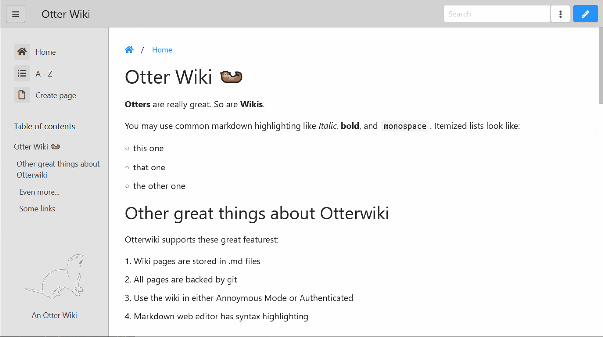

# An Otter Wiki

An Otter Wiki is Python-based software for collaborative content
management, called a [wiki](https://en.wikipedia.org/wiki/Wiki). The
content is stored in a git repository, which keeps track of all changes.
[Markdown](https://daringfireball.net/projects/markdown) is used as
Markup language. An Otter Wiki is written in [python](https://www.python.org/)
using the microframework [Flask](http://flask.pocoo.org/).
[halfmoon](https://www.gethalfmoon.com) is used as CSS framework
and [CodeMirror](https://codemirror.net/) as editor.
[Font Awesome Free](https://fontawesome.com/license/free) serves the icons.

## Notable Features

- Minimalistic interface (with dark-mode)
- Editor with markdown highlighting and support including tables
- Customizable Sidebar: Menu and/or Page Index
- Full changelog and page history
- User authentication
- Page Attachments
- Extended Markdown: tables, footnotes, fancy blocks, alerts and mermaid diagrams
- (experimental) Git http server: clone, pull and push the content of your wiki
- A very cute Otter as logo (drawn by [Christy Presler](http://christypresler.com/) CC BY 3.0)

## Demo

Check out the demo <https://demo.otterwiki.com>.

## Installation

Read the [installation guide](https://otterwiki.com/Installation) to get
started. Recommended is the installation with `docker-compose`.

### Quick start with docker-compose

1. Copy and edit the `docker-compose.yml` below to match your preferences.
2. Run `docker-compose up -d`
3. Access the wiki via http://127.0.0.1:8080 if run on your machine.
4. If the wiki shall be accessible via the internet and an domain name make sure to configure your web server accordingly. Check the [installation guide](https://otterwiki.com/Installation#reverse-proxy) for example configurations for nginx, apache and caddy.
5. Register your account. The first account is an admin-account giving you access to the settings tab.
6. Customize the settings to your liking.

Proceed for the [configuration guide](https://otterwiki.com/Configuration) for
detailed information.

#### docker-compose.yml

```yaml
services:
  otterwiki:
    image: redimp/otterwiki:2
    restart: unless-stopped
    ports:
      - 8080:80
    volumes:
      - ./app-data:/app-data
```

## License

An Otter Wiki is open-source software licensed under the [MIT License](https://github.com/redimp/otterwiki/blob/main/LICENSE).

[modeline]: # ( vim: set fenc=utf-8 spell spl=en sts=4 et tw=72: )
